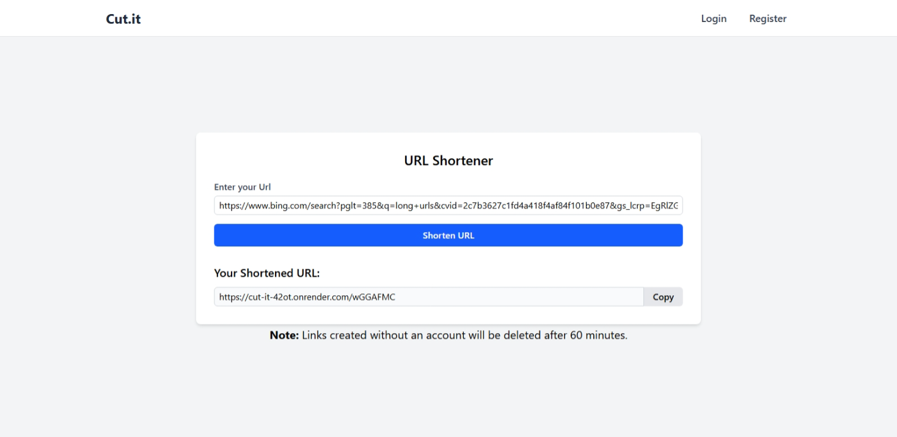
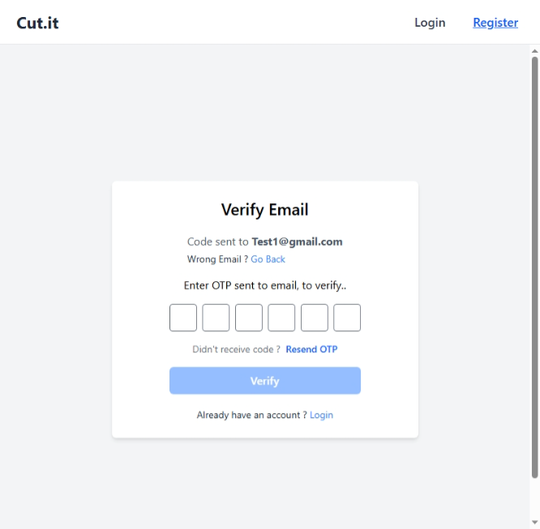

# 🔗 CutIt - URL Shortener || Full Stack Project

A full-stack URL Shortener application built with a modern React frontend and a secure Node.js backend.  

The project supports both **guest users** and **authenticated users**, with features like OTP authentication, URL analytics, QR codes, and rate limiting.

The application is fully **deployed**, and all features have been tested and verified.

---

## 🌐 Live Demo

- **Site:**  
https://cutit-bay.vercel.app/

- **Github repo:**  
https://github.com/anuragv24/URL-Shortner

- **Frontend:** https://cutit-bay.vercel.app/  
- **Backend:** https://cut-it-42ot.onrender.com  

---

## 📸 Screenshots

## 🛠 Tech Stack

### Frontend

- React 19
- Redux Toolkit
- TanStack Query (React Query)
- Tailwind CSS
- TanStack Router
- Axios
- react-qr-code

### Backend

- Node.js
- Express.js
- MongoDB (Mongoose)
- JWT Authentications
- Email OTP (Nodemailer)
- bcryptjs (Password hashing)
- Rate Limiting
- Cookie-based auth support

### Deployment

- Frontend: Vercel
- Backedn: Render
- Database: MongoDB Atlas

## ✨ Features

#### Guest Users

 - Create short URLs without logging in
 - URLs automatically expire after 1 hour
 - Rate limiting to prevent misuse

 #### Authenticated Users

 - Email-based OTP authentication
 - Automatic login after OTP verification
 - Persistent login using refresh tokens
 - Create and manage shortened URLs
 - Custom short URLs
 - QR code generation
 - URL clicks analytics
 - Delete URLs

 #### Security

 - Token based authentication
 - Password hashing using bcryptjs
 - Input validation and sanitization
 - Rate limiting on sensitive endpoints
 - CORS and secure cookie handling

 ### How the Project Works

 1. User submits a long URL
 2. Backend generates a short URL
 3. Visiting the short URL redirects to the original link
 4. Clicks are tracked for analytics
 5. Logged-in users can manage URLs from the dashboard
 6. Authentication handled using OTP + JWT tokens

 ---

 ## Author
 Anurag Verma 

 B.Tech || Computer Science Student

 ---

